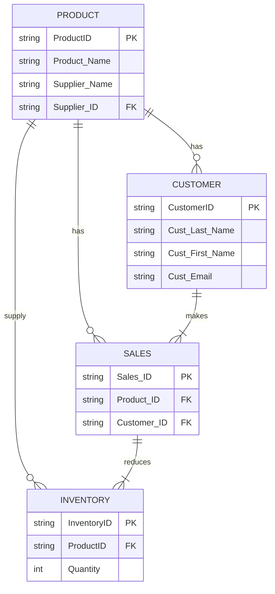

```mermaid
erDiagram
PRODUCT ||--o{ CUSTOMER : has
PRODUCT{string ProductID PK
        string Product_Name
        string Supplier_Name
        string Supplier_ID FK
    }   
    INVENTORY{string InventoryID PK
              string ProductID FK
              int Quantity}
    PRODUCT ||--o{ SALES:  has
    PRODUCT ||--o{ INVENTORY: supply
    CUSTOMER ||--|{ SALES : makes
    CUSTOMER{string CustomerID PK
            string Cust_Last_Name
            string Cust_First_Name
            string Cust_Email}
    
    SALES ||--|{INVENTORY: reduces 
    SALES{  string Sales_ID PK
            string Product_ID FK
            string Customer_ID FK}
   
```
